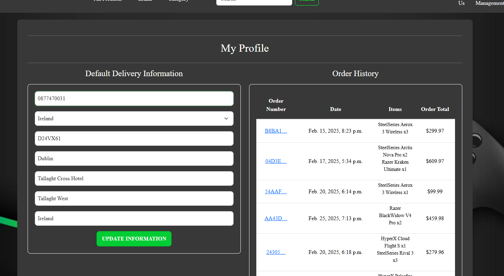

# Epic Merch  

Step into the ultimate gaming haven with **Epic Merch** – your go-to destination for high-quality gaming goods and merchandise! Our platform is designed to provide an effortless shopping experience, allowing you to discover and purchase the coolest gaming gear with ease.  

Whether you're a hardcore gamer or a casual enthusiast, **Epic Merch** has something for everyone. Browse through our extensive collection of gaming products, filter items based on your preferences, and explore detailed product descriptions to find exactly what you need.  

With a seamless checkout process powered by **Stripe**, adding your favorite items to the cart and completing your purchase has never been easier. Plus, track your order history and update your profile information effortlessly. If you're a **superuser**, you can even manage products directly from the website!  

Join the **Epic Merch** community today and level up your gaming setup with the best gear available. Ready to explore? Dive in and experience the ultimate gaming shopping adventure!  

  

[Visit Epic Merch Live](https://epic-merch-565735eb773a.herokuapp.com/)

---

## Table of Contents

### [User Experience](#user-experience-ux)

- [Project Goals](#project-goals)
- [Agile Methodology](#agile-methodology)
- [Target Audience](#target-audience)
- [First time user](#first-time-user)
- [Registered user](#registered-user)
- [Admin user](#admin-user)

### [SEO and Marketing](#seo-and-marketing-1)

### [Design](#design-1)

- [Color Scheme](#color-scheme)
- [Product Images](#product-images)
- [Wireframes](#wireframes)
- [Database Scheme](#database-scheme)
- [Data Model](#data-models)
- [User Journey](#user-journey)

### [Security Features](#security-features-1)

- [User Authentication](#user-authentication)
- [Login Required](#login-required)
- [CSRF Protection](#csrf-protection)
- [Custom Views Security Measures](#custom-views-security-measures)
- [Form Validation](#form-validation)

### [Features](#features-1)

- [Existing Features](#existing-features)
- [Features Left to Implement](#features-left-to-implement)

### [Technologies Used](#technologies-used-1)

- [Languages Used](#languages-used)
- [Databases Used](#databases-used)
- [Frameworks Used](#frameworks-used)
- [Payment Systyem](#payment-system)
- [Programs Used](#programs-used)
- [Emails and Newsletter](#emails-and-newsletter)
- [SEO and Marketing](#seo-and-marketing-2)

### [Deployment and Local development](#deployment-and-local-development-1)

- [Local Development](#local-development)
- [ElephantSQL Database](#elephantsql-database)
- [AWS Amazon](#aws-amazon)
- [Heroku Deployment](#heroku-deployment)

### [Testing](#testing-1)

### [References](#references-1)

- [Docs](#docs)
- [Content](#content)
- [Acknowledgements](#acknowledgements)

---


## User Experience (UX)  

Step into the ultimate gaming universe with **Epic Merch’s E-commerce Platform**, where the world of gaming goods and merchandise awaits. Our platform is designed to provide a seamless and immersive shopping experience, ensuring effortless browsing, purchasing, and engagement with your favorite gaming gear. Every click brings you closer to leveling up your setup with high-quality products tailored for gamers.  

**Epic Merch** is meticulously crafted with user-friendly navigation, featuring a visually captivating interface that enhances your shopping experience. Whether you’re searching for the latest gaming accessories or exclusive collectibles, our personalized recommendations and detailed product information ensure you find exactly what you need.  

Browse through a curated selection of gaming merchandise, conveniently categorized for easy navigation. With our mobile-friendly design, access your wishlist and cart from any device, ensuring a seamless shopping experience wherever you go.  

Experience the excitement of securing the perfect gaming gear, knowing that every purchase enhances your passion for gaming. Enjoy special promotions, including **free shipping on orders over $200**, so you can get your gaming essentials delivered hassle-free.  

**Epic Merch’s E-commerce Platform** is more than just a store; it's a **gaming paradise** where your love for gaming merchandise thrives. Join us in celebrating gaming culture and indulge in the joy of discovering the best gaming gear available. **Game on!** 🎮  


[Visit Epic Merch Live](https://epic-merch-565735eb773a.herokuapp.com/) 🚀  

---  

## Project Goals  

Epic Merch is dedicated to creating a comprehensive and user-friendly e-commerce platform tailored for gaming enthusiasts. The project focuses on:  

- **Enhanced User Experience:** Provide a seamless and intuitive interface for browsing, purchasing, and engaging with a diverse selection of gaming products.  

- **Streamlined Shopping Experience:** Simplify the process of finding and purchasing gaming merchandise by offering personalized recommendations and hassle-free checkout.  

- **Promote Gaming Culture:** Encourage users to discover new gaming gear, accessories, and collectibles through curated collections and featured releases.  

- **Accessibility and Convenience:** Prioritize accessibility by ensuring the platform is optimized for mobile devices, allowing users to browse, shop, and manage their accounts on the go.  

By focusing on these project goals, **Epic Merch** aims to create a seamless and engaging shopping experience for gamers looking for top-quality merchandise.  


## Agile Methodology  

Agile methodology was the core framework for organizing and managing the development of **Epic Merch**. The workflow involved:  

- **User Story Creation:** User stories were carefully crafted following Agile principles, ensuring clear definitions of project goals and user needs.  

- **Epics Development:** Broad epics were defined, each encompassing potential user stories, serving as the foundation for structured development.  

- **Iterative Development:** By breaking down epics into actionable user stories, the project progressed in iterative cycles, refining features and improving functionality.  

- **Github Project Board:** A public project board on GitHub was used to track tasks, organized into columns such as *Todo, In Progress, and Done* for real-time progress visualization.  

- **Task Prioritization:** Issues were labeled based on priority, allowing for structured task management and ensuring that critical functionalities were addressed efficiently.  

By leveraging Agile methodology, **Epic Merch** maintained flexibility, adaptability, and continuous improvement, resulting in a dynamic and efficient development process.  


<details>
<summary> User Stories Template
</summary>


</details>

<details>
<summary> User Stories, Issues
</summary>


</details>

<details>
<summary> Project Milestones
</summary>


</details>

<details>
<summary> Project Board
</summary>


- <a href="https://github.com/users/ObiOne84/projects/5" target="_blank">Visit project GitHub page here.</a>

- <a href="https://github.com/users/ObiOne84/projects/5/views/1?layout=roadmap" target="_blank">Visit project GitHub roadmap here.</a>

</details>

#### Epics

- Project Setup & Deployment
- Milestone 2: Product & Shopping Cart Functionality
- Milestone 3: Checkout, Payments & Order Management
- Milestone 4: Admin Panel & Product Management

#### User Stories

1. View Homepage
**As a user, I want to view the homepage so that I can see an overview of the store and featured products.**

✅ **Acceptance Criteria:**
- The homepage should display featured products, promotions, and navigation links.
- The user should be able to navigate to other pages from the homepage.

2. Browse Products
**As a user, I want to navigate to the products page so that I can browse available products easily.**

✅ **Acceptance Criteria:**
- The products page should list all available products.
- Clicking on a product should take the user to the product details page.

3. Sort Products
**As a user, I want to sort products by price, popularity, or category so that I can quickly find what I am looking for.**

✅ **Acceptance Criteria:**
- Sorting options should be available on the products page.
- The selected sorting method should update the product display accordingly.

4. View Product Details
**As a user, I want to view product details so that I can see product descriptions, images, and pricing before making a purchase.**

✅ **Acceptance Criteria:**
- Clicking a product should open a detailed product page.
- The page should display the product’s name, price, description, and images.

5. Select Product Quantity
**As a user, I want to choose the quantity of a product so that I can buy multiple units if needed.**

✅ **Acceptance Criteria:**
- A quantity selector should be available on the product page.
- The total price should update based on the selected quantity.

6. Add Products to Basket
**As a user, I want to add products to my shopping basket so that I can purchase them later.**

✅ **Acceptance Criteria:**
- Clicking "Add to Cart" should add the product to the basket.
- A confirmation message should be displayed.

7. View Shopping Cart
**As a user, I want to view my cart page so that I can see the products I have added and their total cost.**

✅ **Acceptance Criteria:**
- The cart should display added products, their quantities, and the total price.
- The user should be able to proceed to checkout from the cart page.

8. Modify Cart Items
**As a user, I want to modify the quantity of items in my cart so that I can adjust my order before checkout.**

✅ **Acceptance Criteria:**
- Users should be able to increase or decrease the quantity of products.
- The total cost should update accordingly.

9. Remove Items from Cart
**As a user, I want to delete products from my cart so that I can remove items I no longer want to purchase.**

✅ **Acceptance Criteria:**
- A "Remove" button should be available for each product in the cart.
- Clicking the button should remove the item and update the total price.

10. Proceed to Payment
**As a user, I want to proceed to the payment page so that I can complete my order securely.**

✅ **Acceptance Criteria:**
- Clicking "Checkout" should take the user to the payment page.
- The page should display the order summary before payment.

11. Make Payment Using Stripe
**As a user, I want to pay using Stripe so that my payment is processed safely.**

✅ **Acceptance Criteria:**
- The payment page should integrate Stripe for payment processing.
- A successful payment should redirect the user to the order confirmation page.

12. Receive Order Confirmation Email
**As a user, I want to receive an order confirmation email so that I have proof of my purchase.**

✅ **Acceptance Criteria:**
- After a successful order, an email should be sent to the user.
- The email should contain the order number, product details, and total cost.

13. View Order History
**As a user, I want to view my order history on my profile page so that I can track my past purchases.**

✅ **Acceptance Criteria:**
- The profile page should display past orders with details.
- Clicking on an order should show the full order information.

14. Update Profile Information
**As a user, I want to update my default information on my profile page so that my details are saved for future orders.**

✅ **Acceptance Criteria:**
- Users should be able to update their address, phone number, and email.
- Changes should be saved and reflected in future orders.

15. Register an Account
**As a user, I want to register on the website so that I can place orders and track my purchase history.**

✅ **Acceptance Criteria:**
- A registration form should be available for new users.
- Users should receive a confirmation email after signing up.

16. Add to Wishlist
**As a user, I want to add products to my wishlist so that I can save them for future purchases.**

✅ **Acceptance Criteria:**
- An "Add to Wishlist" button should be available on product pages.
- Users should be able to access and manage their wishlist from their profile.

17. View Related Products
**As a user, I want to see related products on product pages so that I can explore similar or complementary items.**

✅ **Acceptance Criteria:**
- The product page should display related products.
- Clicking a related product should navigate to its details page.

## User Stories for Admin (Superuser)

18. Add New Products
**As a superuser, I want to add new products from the website so that I can update the store’s inventory easily.**

✅ **Acceptance Criteria:**
- A form should be available for adding new products.
- New products should appear in the product listings after saving.

19. Edit Existing Products
**As a superuser, I want to edit existing product details so that I can keep product information up to date.**

✅ **Acceptance Criteria:**
- An "Edit" button should be available for each product.
- Changes should be saved and reflected on the product page.

20. Delete Products
**As a superuser, I want to delete products from the store so that I can remove outdated or unavailable items.**

✅ **Acceptance Criteria:**
- A "Delete" button should be available for each product.
- Deleted products should no longer appear in product listings.

## Target Audience

- **Gaming Enthusiasts & Collectors**: Individuals passionate about gaming culture, seeking exclusive merchandise and high-quality gaming gear.
- **Tech-Savvy Shoppers**: Users who prefer a seamless, intuitive, and efficient online shopping experience.
- **Mobile Gamers & Users**: Customers who shop on the go and require a fully optimized mobile experience.
- **Community-Driven Gamers**: Those who engage with fellow gamers, share reviews, and participate in gaming discussions.
- **Content Creators & Streamers**: Influencers looking for the best gaming accessories to enhance their streaming setups.
- **Gift Shoppers**: People searching for the perfect gaming-related gifts for friends and family.

Epic Merch provides a dynamic e-commerce experience tailored for gamers, offering a curated selection of products, seamless shopping, and a thriving community of gaming enthusiasts.

## First Time User

- Simple and intuitive website navigation for easy exploration and discovery.
- Engaging visuals showcasing available products.
- Informative content providing an overview of the platform’s functionality and upcoming updates.
- Search bar to help users find their favorite gaming merchandise.
- Easy registration process for a hassle-free shopping experience.
- Secure and seamless checkout process.

## Registered User

- Quick and secure login with a personalized user account.
- Ability to browse and review products.
- Faster checkout process with stored payment and shipping details.
- User profile management for updating personal information.
- Wishlist and order tracking for a convenient shopping experience.

## Admin User

- Secure login with admin access control.
- Dashboard for managing products, reviews, and users.
- Ability to add, edit, or remove products and categories.
- User account management, including editing or deleting user profiles and orders.

## SEO and Marketing

Please see [SEO and Marketing](SEO_MARKETING.md) for a detailed analysis of the marketing strategy for Epic Merch.

## Design

The **Epic Merch E-commerce Platform** is crafted to deliver a visually captivating and user-friendly experience, inspired by the dynamic world of gaming.

- **Dark Theme**: The interface features a sleek dark mode for an immersive, high-contrast look that enhances product visibility.
- **Neon Accents**: Neon highlights at the background are used to emphasize key elements, such as call-to-action buttons and important sections.
- **Grid-Based Layout**: Clean and spacious grid-based design ensures smooth navigation and easy product browsing.
- **Interactive Elements**: Hover effects and animations enhance engagement, making the shopping experience more interactive and enjoyable.
- **Mobile-Optimized**: Fully responsive design for seamless shopping across all devices.

### Color Scheme

- The predominant color is **White** `#fff`, providing clarity and contrast for text, icons, and UI elements. It is used extensively in the text, button hover effects, and to create visual separation in UI components like the navbar and footer.

- **Dark Gray** `#383838` serves as the main background color for major layout components such as the navbar, footer, and card containers. It provides a sleek and professional appearance while ensuring that text stands out clearly.

- **Neon Green** `#00FF33` adds a dynamic touch to interactive elements, such as search buttons, input fields on focus, and hover effects. This vibrant color draws attention to actions the user can take, like submitting forms or interacting with dropdown menus.

- **Light Gray** `#A0A0A0` is used for hover effects, primarily in links and navbar elements. It creates a subtle transition effect, guiding the user’s attention as they interact with the page.

- **Black with Opacity** `rgba(0, 0, 0, 0.3)` and `rgba(0, 0, 0, 0.5)` are used for background overlays on specific sections (like product images and detail containers). These translucent shades add depth and allow the content to stand out without losing the background context.

- **Soft White** `#e0e0e0` is used as a border color for table row separations, creating a subtle yet effective distinction between table data and enhancing readability.

### Product Images

- Various high-quality images of delectable foods are strategically placed to evoke the essence of culinary delight. These images contribute to an immersive and engaging visual experience. All product images were sourced from [Amazon](https://www.amazon.com/).

### Typography

- **Lato**: Lato is a modern and versatile sans-serif font. With a clean and friendly appearance, it ensures readability across various platforms. Ideal for paragraphs and body text, Lato provides a contemporary and professional look.

- **Libre Baskerville**: Libre Baskerville is a serif font with a stylish and sophisticated feel. It adds a touch of elegance to headings and subheadings, making it suitable for conveying a sense of formality and structure in your design.

- **Montserrat Alternates**: Montserrat Alternates is a sans-serif font that brings a modern and sleek vibe to your brand. With its clean lines and geometric shapes, it offers a balanced and professional look, perfect for logo designs, headers, and branding elements.

### Wireframes

<details>
<summary>(Large devices) Home Page and Products 
</summary>


</details>

<details>
<summary>(Large devices) Products description and Bag
</summary>


</details>

<details>
<summary>(Large devices) Checkout and Checkout_success
</summary>


</details>

<details>
<summary>(Large devices) Collaborate and Log in
</summary>


</details>

<details>
<summary>(Large devices) Sign up and Profile
</summary>


</details>

<details>
<summary>(Small devices) Home Page and Products 
</summary>


</details>

<details>
<summary>(Small devices) Products description and Checkout
</summary>


</details>

<details>
<summary>(Small devices) Checkout Success and Collaborate
</summary>


</details>

<details>
<summary>(Small devices) Log in and Sign in
</summary>


</details>

<details>
<summary>(Small devices) Profile
</summary>


</details>

<details>
<summary>(Small devices) Bag
</summary>


</details>

### Database Scheme

#### Entity Relationship Diagram (ERD)

> The current data scheme comprises models essential for the Minimum Viable Product (MVP) of the product purchase system. Epic Merch includes core functionality such as product management, user profiles, order processing, and wishlists. The system also introduces Categories, allowing users to browse and filter products more effectively. 

<details>
<summary> Data Scheme </summary>


</details>

### Data Models

1. **User**:

   - Represents the user who registers, logs in, and interacts with the platform.

   Fields:
   - `id`: Primary key for the user.
   - `username`: Username for the user.
   - `email`: Email address of the user.
   - `password`: Hashed password for user authentication.
   - `first_name`: First name of the user (optional).
   - `last_name`: Last name of the user (optional).

2. **Category**:

   - Represents product categories, which are used to classify products into different groups.

   Fields:
   - `id`: Primary key for the category.
   - `name`: The name of the category.
   - `friendly_name`: Optional user-friendly name for the category.

3. **Product**:

   - Represents the various products (e.g., books, comics) sold in the store.

   Fields:
   - `id`: Primary key for the product.
   - `category_id`: Foreign key linking to the Category model.
   - `sku`: Stock Keeping Unit (SKU) of the product (optional).
   - `name`: Name of the product.
   - `brand`: The brand of the product (optional).
   - `description`: A description of the product.
   - `price`: Price of the product.
   - `image`: URL of the product image (optional).
   - `color`: The color of the product (optional).
   - `wireless`: Boolean indicating if the product is wireless (optional).

4. **UserProfile**:

   - Stores additional information about the user, such as their delivery information.

   Fields:
   - `id`: Primary key for the user profile.
   - `user_id`: Foreign key linking to the User model.
   - `default_phone_number`: Default phone number for the user (optional).
   - `default_country`: Default country for the user (optional).
   - `default_postcode`: Default postcode for the user (optional).
   - `default_town_or_city`: Default town or city (optional).
   - `default_street_address1`: First line of the street address (optional).
   - `default_street_address2`: Second line of the street address (optional).
   - `default_county`: Default county (optional).

5. **Wishlist**:

   - Represents the user's wishlist, allowing them to save products for later.

   Fields:
   - `id`: Primary key for the wishlist item.
   - `user_id`: Foreign key linking to the User model.
   - `product_id`: Foreign key linking to the Product model.
   - `added_at`: The timestamp when the product was added to the wishlist.

6. **ContactRequest**:

   - Represents an inquiry or support request submitted by a user.

   Fields:
   - `id`: Primary key for the contact request.
   - `name`: Name of the requester.
   - `email`: Email address of the requester.
   - `message`: The inquiry or message text.
   - `read`: Boolean indicating whether the request has been read (default: false).

7. **Order**:

   - Represents an order placed by a user, including delivery and payment details.

   Fields:
   - `id`: Primary key for the order.
   - `order_number`: Unique order number.
   - `full_name`: Full name of the person placing the order.
   - `user_profile_id`: Foreign key linking to the UserProfile model.
   - `email`: Email address of the person placing the order.
   - `phone_number`: Phone number for the order.
   - `country`: Delivery country.
   - `postcode`: Delivery postcode (optional).
   - `town_or_city`: Delivery town or city.
   - `street_address1`: First line of the delivery address.
   - `street_address2`: Second line of the delivery address (optional).
   - `county`: Delivery county (optional).
   - `date`: Timestamp for when the order was placed.
   - `delivery_cost`: Delivery cost for the order (default: 0).
   - `order_total`: Total price of the order (default: 0).
   - `grand_total`: Total cost including delivery (default: 0).
   - `original_bag`: TextField to store the original cart data (items in the cart before checkout).
   - `stripe_pid`: Stripe payment ID.

8. **OrderLineItem**:

   - Represents individual items in an order, capturing product details and quantity.

   Fields:
   - `id`: Primary key for the order line item.
   - `order_id`: Foreign key linking to the Order model.
   - `product_id`: Foreign key linking to the Product model.
   - `product_size`: Size of the product (optional).
   - `quantity`: Quantity of the product.
   - `lineitem_total`: Total price for this line item.

9. **NewsletterSubscriber**:

   - Represents a user who has subscribed to the newsletter.

   Fields:
   - `id`: Primary key for the newsletter subscriber.
   - `email`: Email address of the subscriber.
   - `date_subscribed`: DateTime when the user subscribed.

10. **Subscriber**:

   - Represents a user who has subscribed to receive notifications, news, or updates.

   Fields:
   - `id`: Primary key for the subscriber.
   - `email`: Email address of the subscriber.
   - `subscribed_at`: DateTime when the subscription occurred.

---

This section provides an overview of the database models used in **OwlBookstore**, highlighting their relationships and purpose within the platform. The data model supports the core functionalities of the platform, such as managing products, handling orders, and enabling user interaction through wishlists, contact requests, and newsletter subscriptions. The schema also sets the foundation for future features like the **Community Forum** and **Book Exchange Market**.

## Security Features

### User Authentication

- Django Allauth is a powerful and comprehensive third-party package for handling authentication, registration, and account management in Django applications. It provides several security features to help protect user accounts and sensitive information.

### Login Required

- In Django, LoginRequiredMixin is a mixin class provided by the django.contrib.auth.mixins module. It is used in class-based views to require that the user making the request must be authenticated. If the user is not authenticated, the mixin will automatically redirect the user to the login page.

- You can use LoginRequiredMixin by inheriting it in your class-based views. Typically, it's used as the leftmost mixin in the inheritance chain to ensure that authentication checks are performed before any other mixins. If the user is authenticated, the view proceeds as normal. If the user is not authenticated, the LoginRequiredMixin automatically redirects them to the login page.

- Using LoginRequiredMixin helps in enforcing authentication requirements for views where you want to ensure that only authenticated users have access. It simplifies the process of handling authentication checks and redirects in class-based views.

- Similarly, ``@login_required`` is a decorator commonly used in web development frameworks like Django in Python. When applied to a view function, it ensures that the user accessing that particular view is logged in. If the user is not logged in, they are typically redirected to a login page or given an appropriate error message, depending on how it's configured. This decorator helps protect sensitive or restricted views, ensuring that only authenticated users can access them.

### CSRF Protection

- In Django, CSRF (Cross-Site Request Forgery) protection is implemented using a CSRF token. The CSRF token is a unique value associated with a user's session, and it is used to verify the legitimacy of a form submission. When a user logs in or visits a page with a form, Django generates a unique CSRF token for that user's session. Django provides built-in middleware (django.middleware.csrf.CsrfViewMiddleware) that automatically checks and enforces CSRF protection for all incoming POST requests.
The middleware ensures that each form submission includes a valid CSRF token.
By incorporating these CSRF protection mechanisms, Django helps prevent attackers from executing malicious actions on behalf of authenticated users. The use of unique tokens tied to user sessions adds an additional layer of security, ensuring that form submissions are authorized and originate from legitimate sources.

- When rendering an HTML form, Django includes the CSRF token as a hidden input field within the form. The  template tag is used to include the CSRF token in the form. See example below:

```html
<form method="post" action="">
    
    

    <button type="submit">Submit</button>
</form>
```

### Custom Views Security Measures

- Overall, views incorporate authentication checks, form validation, and ownership verification to secure various operations. It's important to note that Django's built-in features, such as the authentication system, contribute to the overall security of the application.

  - The `all_products` view handles different scenarios gracefully and provides appropriate error messages to users. For instance, it informs users if there are no results matching their search query or category selection, and it redirects them to the appropriate page. Filtering of querysets (comics and books) based on user inputs is done using Django's ORM, which helps prevent direct SQL injection vulnerabilities. Also, pagination is implemented, which helps prevent overloading the server with large amounts of data requested by users. Lastly, the Django messages framework is used to display messages to users and the view only exposes necessary data to users, such as product information, search results, and pagination controls, while keeping sensitive server-side logic and data hidden from clients.
  - The `product_detail` view checks if the provided product ID exists in the database before attempting to retrieve the product details. This helps prevent potential database-related errors or exploitation attempts. Before allowing users to submit a review, the view checks if the user is authenticated. If not, it redirects them to the login page and displays an appropriate error message. This prevents unauthorized access to the review functionality. When users submit a review, the view validates the form data. If the form is not valid, an error message is displayed to the user, ensuring that only properly formatted and validated reviews are accepted.
  - The `add_product` and `edit_product` views are protected using the LoginRequiredMixin, ensuring that only authenticated users can access it. Within the dispatch method, an additional check is performed to ensure that only users with superuser privileges (typically site owners) can access the views. If a user without superuser privileges attempts to access the views, they are redirected to the home page with an error message. The views validate the form data submitted when adding a new book or comic.
  - The `add_to_wishlist`, `remove_from_wishlist`, `delete_product`. Similar to the add_product view, an authorization check is performed to ensure that only superusers (store owners) can update products. If a non-superuser attempts to access this view, they are redirected to the home page with an error message. Additionaly, if the requested product does not exist, the view renders a custom 404 page, which provides a user-friendly error message. This prevents exposing internal details of the application and maintains a better user experience.
  - The `profile` view implements security measures to protect user profiles, validate form data, and provide feedback to users about the outcome of profile updates.
  - The `order_history` view implements security measures to protect user order history, ensure authorization, and provide relevant feedback to the user about the viewed order.
  - The home app views providing feedback messages (success or error messages) to users after form submission. The form consist data validation, and user's messages are limited to 1000 charactres.
  - The checkout app views ensure that form to used to collect data are valid before submissoin. Moreover, the payment process is handled securely by Stripe. The user's input is validated before processing and errors are displayed gracefully.
  - The bag app views validate data inputs, to ensure that correct information are processed. Errors are handled gracefully using Django's messaging system. Session data is used to store only bag content. Also, users can only add limited number of each number to their bag (10 units).

### Form Validation

Forms in the project use basic Django form validation.

## Features

- **Home Page**  
  - Displays a navigation bar with the store logo, hero section, and a "Shop Now" button that directs unregistered users to the products page.  
  - The footer contains links to "About Us", "Contact Us", "FAQ", and "Privacy Policy" sections, as well as social media links and a newsletter sign-up form.  
  - The search bar allows users to filter products by name, category, price, or rating.  
  - The "MyAccount" section enables users to log in, sign up, view their profile, and access the admin panel (for store admins).
  
  

- **Unregistered Users (All Users)**  
  - Users can sign up for an account and log in.  
  - Users can browse, search, and view detailed product information.  
  - Users can add products to the shopping cart.  
  - Users can access various store-related pages via the footer links.

  

- **Registered Users**  
  - After logging in, users can access:  
    - **My Profile**: View and update personal information, including default delivery address.
    - **Order History**: View past orders and track their status.
    - **Wishlist**: Manage a list of favorite products for future purchase.
    - **Password & Email Updates**: Update account details like email and password.
    - **Wishlist Management**: Add or remove items from the wishlist and move items to the shopping cart.
  
  

- **Admin Features**  
  - Admin users can:  
    - Add, edit, or delete products.  
    - Approve or delete product reviews.  
    - Access the admin panel to manage user accounts and orders.

  

- **Newsletter Subscription Form**  
  - Users can subscribe to the store's newsletter directly from the home page footer.  
  - They enter their email address to receive promotions, updates, and store news.
  
  

- **Brands Section**  
  - The home page features a **Brands Section** that showcases various brand logos.  
  - Users can click on brand logos to view products available from that brand.

  

- **Last Listings Section**  
  - The **Last Listings** section displays recently added products to the store.  
  - This section allows users to quickly view the most recent products available for purchase.

  

---

## Existing Features

- **Profile Page**
  - Users can view and manage their profile details, including:  
    - **Order History**: View past orders and their current status.
    - **Wishlist**: Access and manage their wishlist of favorite products.
    - **Default Delivery Information**: View and edit the default shipping address for their orders.

  

- **Navigation Bar**
  - The navigation bar includes a search bar, links to various pages, and dynamic cart information.  
    - For registered users, it shows the cart and user profile options.
    - For admins, it includes an admin panel link.

  

- **Footer**
  - Contains copyright info, social media links, and newsletter subscription.  
  - Newsletter sign-up appears as a pop-up on hover (desktop) or on click (mobile).

  

- **Banner**
  - A rotating banner highlights promotions, free delivery offers, and newsletter subscription options.

  

- **Sign Up Page**
  - Users can sign up with a username and password to create an account.

  

- **Login Page**
  - Users can log in with their credentials.

  

- **Browse Available Products**
  - Users can browse through a catalog of products with filter and sort options (by price, name, rating, category).

  

- **Product Page**
  - Each product is displayed with images, description, price, and quantity options.
  
  
  
- **Pagination & Sorting**
  - Product pagination supports up to 24 products per page, and sorting options include price, category, name, and rating.

  

- **Basket & Checkout**
  - Users can view products in the shopping cart and proceed to checkout.

  
   

- **Wishlist**
  - Users can add or remove products to/from their wishlist for future reference.

  


---

## Features Left to Implement

- **Advanced User Reviews**  
  - Allow users to filter reviews by rating and date.

- **Advanced Wishlist Features**  
  - Ability for users to share their wishlists or purchase items from other users' lists.

- **Gifts and Merchandise**  
  - Expand the store with additional items such as apparel, posters, and collectible merchandise.
  
- **Community Forum**  
  - Implement a forum for users to discuss their favorite products, genres, and trends.

  ## Technologies Used

### Languages Used

- [HTML5](https://en.wikipedia.org/wiki/HTML5)
- [CSS3](https://en.wikipedia.org/wiki/CSS)
- [JavaScript](https://en.wikipedia.org/wiki/JavaScript)
- [Python](https://en.wikipedia.org/wiki/Python_(programming_language))

### Databases Used

- [ElephantSQL](https://www.elephantsql.com/) - Postgres database
- [AWSAmazon](https://aws.amazon.com/) - Online static and media file storage

### Frameworks Used

- [Django](https://www.djangoproject.com/) - Python framework. Django is a high-level Python web framework that encourages rapid development and clean, pragmatic design. Built by experienced developers, it takes care of much of the hassle of web development, so you can focus on writing your app without needing to reinvent the wheel. It’s free and open source. (Source: [Django](https://www.djangoproject.com/))
- [Bootstrap 5.1](https://getbootstrap.com/docs/5.1/getting-started/introduction//) - CSS framework. Bootstrap is a popular open-source front-end framework that provides a collection of tools, styles, and components to simplify the process of designing and building responsive and mobile-first web pages.
- [jQuery 3.7.1](https://code.jquery.com/jquery-3.7.1.js) - jQuery is a fast, small, and feature-rich JavaScript library. It simplifies things like HTML document traversal and manipulation, event handling, and animation for web development. jQuery is open-source and designed to make things like HTML document traversal and manipulation, event handling, and animation much simpler with an easy-to-use API that works across a multitude of browsers. (Source: [jQuery](https://api.jquery.com/))

### Payment System

- [Stripe](https://stripe.com/ie) - Stripe is a technology company that provides online payment processing services, allowing businesses to accept payments securely over the internet. It offers a range of tools for handling transactions, subscriptions, and more.

### Programs Used

- [Github](https://github.com/) - Used for creating application repository, version control, organising workflow utilising agile functionality of GitHub project, issues and milestones.
- [Gitpod](https://www.gitpod.io/) - Used as a coding environment.
- [Heroku](https://www.heroku.com/) - Used as the cloud-based platform to deploy the site.
- [Google Fonts](https://fonts.google.com/) - Used for the typography.
- [Balsamique](https://balsamiq.com/) - Used for creation of wireframes.
- [DbDiagram](https://dbdiagram.io/) - Used for creation of ERD.
- [Jinja](https://jinja.palletsprojects.com/en/3.1.x/) - Templating engine
- [Compress.png](https://compresspng.com/) - Used to reduce the size of images.
- [favicon.io](https://favicon.io/) - Used to convert images into icons.
- [JSHint](https://jshint.com/) - Used to validate JavaScript
- [W3C Markup Validation Service](https://validator.w3.org/) - Used to validate HTML
- [CSS Validation Service](https://jigsaw.w3.org/css-validator/) - Used to validate CSS
- [CI Python Linter](https://pep8ci.herokuapp.com/) - Used to validate Python

### Emails and Newsletter

- [Gmail](https://mail.google.com/) - User for email services

### SEO and Marketing

- [XML Sitemaps](https://www.xml-sitemaps.com/) - sitemap generator

## Deployment and Local Development

### Local Development

#### How to Fork

To fork the repository, follow the steps below:

1. Log in to your [GitHub](https://github.com).
2. Navigate to the repository for this project [Epic Merch](https://github.com/nazar0309/epic_merch)
3. In the top right corner of the window, click on the Fork button.
4. The process will start, and you will see the message confirming the start.

Remember that if you forked the repository, none of the updates made to the source repo would be reflected in your forked repo.

#### How to Clone

To bring down project for local development, it is possible to clone a repository by following steps below:

1. Log in(or Sign Up) to [GitHub](https://github.com).
2. Navigate to the repository for this project [Epic Merch](https://github.com/nazar0309/epic_merch)
3. Above the list of files, click the green button Code.
4. Select Local tab.
5. Copy to HTTPS code.
6. In your local IDE open terminal, choose the location where you want to clone the directory.
7. Type `git clone` and then paste the URL you copied from GitHub in step 5.
8. Set up a virtual environment (not required if you are using the Code Institute template and GitPod or Codeanywhere - this will be already set up).
9. Press Enter to create the clone.
10. Install packages by running command `pip3 install -r requirements.txt`

### ElephantSQL Database

1. Login to [ElephantSQL](https://www.elephantsql.com/) PostgreSQL Database.
2. Click Create New Instance.
3. Set up your plan:
    - give your plan name - commonly project name
    - select Tiny Turtle (Free) plan
    - you can leave the tags blank
4. Select the Region and data center near you.
5. Click Review.
6. Check your details are correct and then click Create instance.
7. Return to the ElephantSQL dashboard and click the database name you just created.
8. In the URL section, click and copy icon to copy the database URL (you will need this for your **env.py** file)

### AWS Amazon

1. Create AWS account and go to AWS Management Console in the My Account dropdown
2. Find and access S3 as a service and create a new bucket:
3. Under Object Ownership, check "ACLs enabled"
4. Uncheck "Block all public access" and acknowledge (required for public access to static files)

5. Configur bucket settings:

    - Under Properties, enable Static Website Hosting
    - Under Permissions, copy the following code into CORS section:

    <details>
    <summary> Code snippet.
    </summary>

    ```javascript
    [
        {
            "AllowedHeaders": [
                "Authorization"
            ],
            "AllowedMethods": [
                "GET"
            ],
            "AllowedOrigins": [
                "*"
            ],
            "ExposeHeaders": []
        }
    ]
    ```

    </details>

    This is required to set up the access between the Heroku app and the S3 bucket.

6. Under Bucket policy, go to Policy generator.

    - Bucket Type = S3 Bucket Policy
    - Principal = * (allows all principles)
    - Actions = GetObject
    - Paste in ARN from bucket settings tab.
    - Click Add Statement, then Generate Policy.
    - Copy policy in paste into bucket policy editor. Also add /* onto the end of the resource key.
    - Click Save.
    - Under Access control list (ACL), check "List" checkbox for "Everyone (public access)"

7. Create user to access bucket with IAM (Identity and Access Management)

    - In IAM, got to User Groups (sidebar left).
    - There create a group for a user, create an access policy giving the group access to the S3 bucket and assign the user to the group so it can use the policy to access all files.

8. Connect Django to S3

    - Install packages "boto3" and "django-storages" and add 'storages' to INSTALLED_APPS in settings.py
    - Configure settings.py accordingly, including necessary AWS variables.

    <details>
    <summary> Code snippet.
    </summary>

    ```python
    # AWS settings
    if 'USE_AWS' in os.environ:
    # Cache control
    AWS_S3_OBJECT_PARAMETERS = {
        'Expires': 'Thu, 31 Dec 2099 20:00:00 GMT',
        'CacheControl': 'max-age=94608000',
    }
    
    # Bucket Config
    AWS_STORAGE_BUCKET_NAME = 'nazar0309'
    AWS_S3_REGION_NAME = 'eu-north-1'
    AWS_ACCESS_KEY_ID = os.environ.get('AWS_ACCESS_KEY_ID')
    AWS_SECRET_ACCESS_KEY = os.environ.get('AWS_SECRET_ACCESS_KEY')
    AWS_S3_CUSTOM_DOMAIN = f'{AWS_STORAGE_BUCKET_NAME}.s3.amazonaws.com'

    # Static and media files
    STATICFILES_LOCATION = 'static'
    MEDIAFILES_LOCATION = 'media'
    STORAGES = {
    "default": {
        "BACKEND": "custom_storages.MediaStorage",
    },
    "staticfiles": {"BACKEND": "custom_storages.StaticStorage"},
    }

    # Override static and media URLs in production
    STATIC_URL = f'https://{AWS_S3_CUSTOM_DOMAIN}/{STATICFILES_LOCATION}/'
    MEDIA_URL = f'https://{AWS_S3_CUSTOM_DOMAIN}/{MEDIAFILES_LOCATION}/'

    ```

    </details>

9. Add new config vars in Heroku app settings, including user credentials from AWS.
10. Create custom_storages.py file.
11. Upload static files and media files to S3
12. Add Stripe keys to Heroku
    - From Stripe account, under Developers > API keys copy Public Key and Secret Key and set as config vars in Heroku app settings.
    - Create new Webhook endpoint for deployed site and enable all events. Then add Signing Secret to Heroku app config vars.

### Heroku Deployment

- Log into [Heroku](https://www.heroku.com/) account or create an account.

- Click the "New" button at the top right corner and select "Create New App".
- Enter a unique application name
- Select your region
- Click "Create App"

#### Prepare enviroment and settings.py

- In your workspace (GitPod) create an **env.py** file and add it to **.gitignore**

- Add the **DATABASE_URL** value and your chosen **SECRET_KEY** value to the **env.py file**.
- Update the **settings.py** file to import the **env.py** file and add the SECRET-KEY and DATABASE_URL file paths.

    <details>
    <summary> See the code sample
    </summary>

    ```python
    from pathlib import Path
    import os
    import dj_database_url
    if os.path.isfile('env.py'):
        import env
    ```

    </details>

- Comment out the original DATABASES variable and add the code below.

    <details>
    <summary> See the code sample
    </summary>

    ```python
    # DATABASES = {
    #     'default': {
    #         'ENGINE': 'django.db.backends.sqlite3',
    #         'NAME': BASE_DIR / 'db.sqlite3',
    #     }
    # }
        
    DATABASES = {
        'default': dj_database_url.parse(os.environ.get("DATABASE_URL"))
    }
    ```

    </details>

- Don't forget to makemigrations and migrate to update your database.
- Add Heroku to the ALLOWED_HOSTS in settings.py

    <details>
    <summary> See the code sample
    </summary>

    ```python
    ALLOWED_HOSTS = [
    'your-app-name.herokuapp.com/',
    ]
    ```

    </details>

- Add the following Config Vars in Heroku:
  - `SECRET_KEY` (Any Django random secret key).
  - `PORT` = 8000.
  - `DISABLE_COLLECTSTATIC` = 1 (temporary and can be removed once static files are created).
  - `DATABASE_URL` (paste ElephantSQL database URL here).
  - `STRIPE_SECRET_KEY`
  - `STRIPE_PUBLIC_KEY`
  - `STRIPE_WH_SECRET`
  - `AWS_SECRET_ACCESS_KEY`
  - `AWS_ACCESS_KEY_ID`

- Heroku Additional Files:
  - Create requirements.txt
  - Create Procfile.

    <details>
    <summary> See the code sample (for gunicorn)
    </summary>

    ```python
    web: gunicorn codestar.wsgi
    ```

    </details>

#### Deploy

1. Before deployment change DEBUG = False in the settings.py, to prevent sharing sensitive information with the public.
2. Connect to GitHub in the deploy tab on Heroku app, and find your project repository.
3. At the bottom of the page you can choose Enable Automatic Deploys for automatic deployments or Deploy Branch to deploy manually. Keep in mind that manually deployed branches will need to be re-deployed after each time the GitHub repository is updated.
4. Click 'Open App' to view the deployed live site.

Site is now live

You can visit the deployed application at [Epic Merch](https://epic-merch-565735eb773a.herokuapp.com/)

## Testing

Please see  [TESTING.md](TESTING.md) for all the detailed testing performed.

## References

### Docs

- [jQuery](https://api.jquery.com/)
- [Bootstrap 5.1](https://getbootstrap.com/docs/5.1/getting-started/introduction/)
- [Django docs](https://docs.djangoproject.com/en/5.0/)
- [Django Allauth](https://docs.allauth.org/en/latest/)
- [Stack Overflow](https://stackoverflow.com/)
- [GitHub Markdown Cheet Sheet](https://github.com/adam-p/markdown-here/wiki/Markdown-Cheatsheet)

### Content

- [Amazon UK](https://www.amazon.co.uk) - all images for the products and content.
- [OwlBookstore](https://github.com/ObiOne84/project-5-e-commerce) - the structure of the readme file.
- [Code Institute](https://codeinstitute.net/ie/) - [Boutique Ado](https://github.com/Code-Institute-Solutions/boutique_ado_v1/tree/250e2c2b8e43cccb56b4721cd8a8bd4de6686546) project - for stripe setup, AWS setup, javascript for bag buttons, arrow up scroll and toast styling.
- [FreePik](https://whttps://www.freepik.com/) - images used for the hero page.

### Acknowledgements

- I am deeply grateful to my mentor, Mitko Bachvarov, for his unwavering support and invaluable feedback throughout the project.


